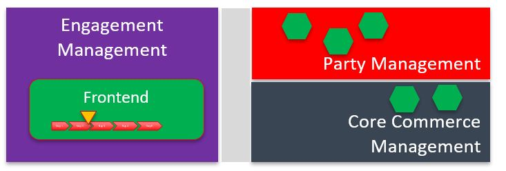
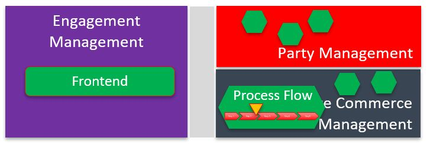
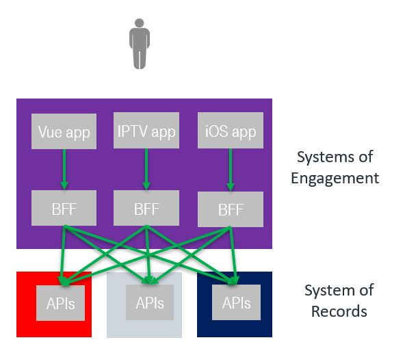

= IG1228 ODA/API Call Flow Use Cases 
TM Introductory Guide
Revision
:Revision: 2.3.0
:Date: Jan. 31st, 2021
:IPR-Mode: RAND
:Status: Draft
:Release-Status: Pre-Production
:url-repo: http://github.com/tmforum-rand/api-call-flows
:doctype: book
:toc: 

:sectnums:

== Introduction

The objective of this presentation is to illustrate through simple use cases 

* dynamic view of ODA Functional Architecture (to be progressively extended in next versions to the global Order to Cash process)
* Usage of TMF Open APIs
* A draft list of ODA macro-components, represented as vertical lines in the sequence diagrams
* 2 possible ways of distributing processes and macro-components and TMF API orchestration
** A: Using the concept of BFF, in charge of process orchestration and TM Forum API orchestration
** B: Using TMF 701 Process Flow API to decouple front-ends and process layers. 

* We started to share this presentation with other TMF working groups, and it could be modified according to their remarks
** Open APIs workgroup
** ODA Reference Implementation workgroup

=== Different approaches regarding management of the overall process

* SoE = Systems of Engagement
* SoR = Systems of Records

[cols="<,^.^"]
|===
| Approach description | Architecture overview

| *Approach A: SoE steer the process*

* The Frontend manages the process by itself and knows what is the next task to proceed with
* It may compute the position of the customer in the process on basis of infos stored in the SoRs (e.g. Shopping Cart)
a| 

| *Approach B: SoR steer the process*

* The Frontend asks the Process Flow API which task needs to be performed by the next step of the process
* The Frontend decides on the best way to perform the task, it may use more than one ‘screen’ to perform one step
* The Process Flow can be part of several ODA components, that then delegate each other portions of the overall process
a| 

|===

=== Relationship to BFF pattern

The BFF (backend-for-frontend) is a well established IT concept to technically decouple frontend applications running on customer device from backend APIs

Example for frontend applications running on customer device: Vue, React or Angular single page application in browser, Swift iOS app, IPTV set top box app…

Both application on customer device and BFF are parts of the ODA Engagement domain

In approach A to process management the BFF is usually the place where the process is managed

=== Approach A : SoE steer the process

* Frontends can define the processes autonomously while leveraging the Open APIs provided by the SoRs
* The components implementing the Open APIs, in case of creation or update of entities, have to check the business rules (e.g. when creating the ProductOrder its content is fully checked by the ProductOrdering component)
* It’s the responsibility of each frontend to optimize the/its process by analyzing the global status obtained by interrogating the entities from the Open APIs (e.g. if an installation address has already been defined for a Product in the Shopping Cart the frontend may skip querying that address again)

=== Approach B : SoR steer the process

* Based on independent macro-components, each covering a set of related business processes, business entities and APIs.
* Front-Ends are in charge of GUI kinematics and presentation layer. They can directly query any type of business entities they are allowed to. 
* Front-Ends never directly trigger creation or update of business entities. They provide needed inputs to the process layer in charge, as the process layer requires.
* *TMF 701 Process Flow API* is used here to decouple front-ends and process layers, as recommended in ODA Functional Architecture
So APIs and macro-components are directly reusable by any Front-End, or by any other process needing to trigger the related process (ex: creation of a Party)
* Processes are data driven (catalogue driven for the order capture) and they drive the GUI, so customer/user journey is not linear : only useful steps are presented to the customer/user
* *TMF 688 Event API* is used  to trigger events that can be transmitted to any other macro-component.
* All exchanges are covered by TMF Open APIs

== Use cases

:leveloffset: +1

:imagesdir: use-cases/UC001
include::use-cases/UC001/index.adoc[]

:imagesdir: use-cases/UC002
include::use-cases/UC002/index.adoc[]

:imagesdir: use-cases/UC003
include::use-cases/UC003/index.adoc[]

:imagesdir: use-cases/UC004
include::use-cases/UC004/index.adoc[]

:imagesdir: use-cases/UC005
include::use-cases/UC005/index.adoc[]

:imagesdir: use-cases/UC006
include::use-cases/UC006/index.adoc[]

:leveloffset: -1

== Components identified in the use cases

=== Product Order Capture Validation

[yaml]
----
include::components/CoreCommerce/ProductOrderCaptureValidation.yml[]
----

=== Document History

==== Version History

This section records the changes between this and the previous document
version as it is edited by the team concerned. Note: this is an
incremental number which does not have to match the release number and
used for change control purposes only.

[options=header]
|===
|Version Number |Date Modified |Modified by: | Description of changes

|1.0.0 |02-Oct-2020 | Alan Pope, TM Forum |Final edits prior to publication
|2.0.0 |27-Nov-2020 | Alan Pope, TM Forum |Final edits prior to publication
|2.1.0 |29-Jan-2021 | Alan Pope, TM Forum |Final edits prior to publication

|===

==== Release History

This section records the changes between this and the previous Official
document release. The release number is the ‘Marketing’ number which
this version of the document is first being assigned to.

[options=header]
|===
|Release Status |Date Modified |Modified by: |Description of changes

|Pre-production |02-Oct-2020 |Alan Pope |Initial release of document
|Production |24-Nov-2020 |Adrienne Walcott |Updated to reflect TM Forum approved status
|Pre-production |27-Nov-2020 |Alan Pope |Updated to version 2.0.0
|Production |18-Jan-2021 |Adrienne Walcott |Updated to reflect TM Forum approved status
|Pre-production |29-Jan-2021 |Alan Pope |Updated to version 2.1.0

| | | |
|===

=== Acknowledgments

This document was prepared by the members of the TM Forum API team:

* Sylvie Demarest, Orange
* Ludovic Robert, Orange
* Brice Petitfrère, Orange
* Alexis de Peufeilhoux, Deutsche Telekom
* Konstantin Petrosov, Deutsche Telekom