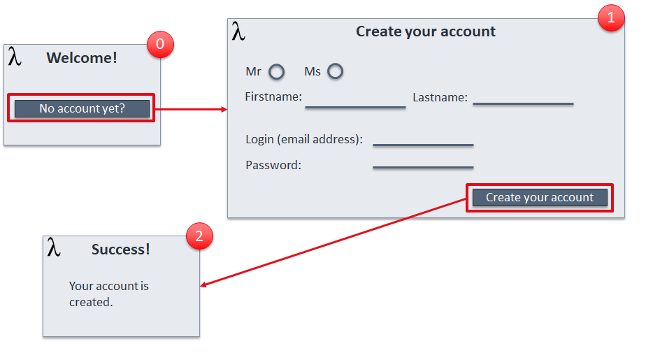

== UC001: New Party – Create your « account »

=== Screen flow

=== Description

* Step 0
** A person, not yet known by the operator, connects to one of the operator front-end and is proposed to create his « account »
*** For the operator the global term « account » corresponds to a set of information to be registered
**** Create a Party/person, status initialized
**** Create a contact method (mail address)
**** Assign a default « Prospect » or « Portal User » Role to the Party/person
**** Create an Electronic Identity (login / Password) and associate it to the Party/person
** He agrees to create his « account »

* Step 1
** The Front-end presents the set of information to enter
** The person enters the information and triggers the « account » creation

* Step 2
** Information entered have been transmitted to the process layer, checked and registered. 
** The « account » is created so the person can now identify / authenticate himself 

=== API call flow
==== Approach A (SoE steer the process)

[plantuml]
----
include::UC1-A-CreateParty.puml[]
----

==== Approach B (SoR steer the process)

[plantuml]
----
include::UC1-B-CreateParty-0.puml[]
----

[plantuml]
----
include::UC1-B-CreateParty-1.puml[]
----

[plantuml]
----
include::UC1-B-CreateParty-2.puml[]
----

