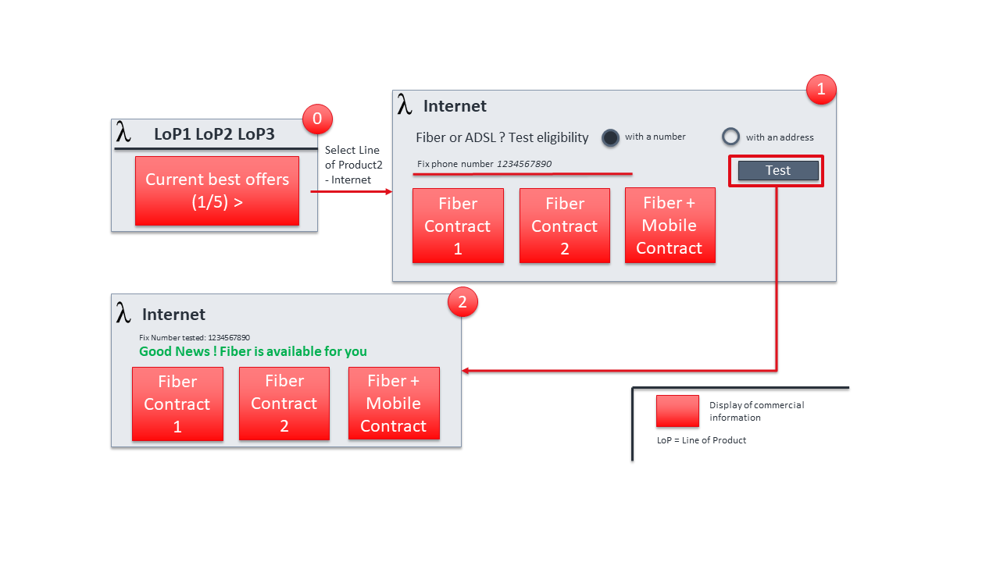

== UC002: Browse B2C catalogue and check Fiber technical eligibility

=== Screen flow

=== Description

* Step 0
** A person connects to one of the operator front-end and want to browse the operator catalogue. 
** He has the choice between several lines of product, and he can also browse the operator current best offers
** He chooses the Internet Line of Product

* Step 1
** The front-end displays a selection of internet offers, and propose to check fiber technical eligibility based on the person fix phone number or geographical address
** The person enters his fix phone number et triggers the test

* Step 2
** Eligibility check is OK. 
** The person can now start an order capture process, choosing one of the proposed fiber offers

=== API call flow
==== Approach A (SoE steer the process)

[plantuml]
----
include::UC2-A-catalogAndTechnicalEligibility.puml[]
----

==== Approach B (SoR steer the process)

[plantuml]
----
include::UC2-B-catalogAndTechnicalEligibility.puml[]
----

