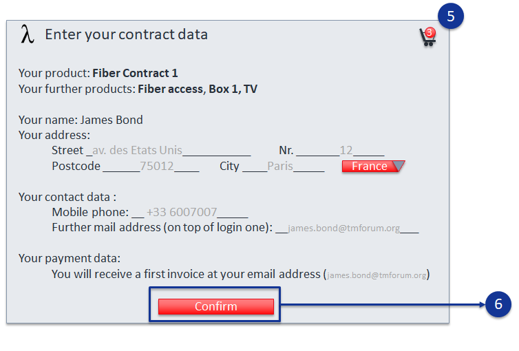

== UC003: Order capture – Fiber contract

=== Screen flow

image::uc3-1.png[]

image:uc3-5.png[]

=== Catalog view

CFS & Products specifications:
image:ps-cfs.jpg[]

Global catalog view:

Product order view:
image:order-view.jpg[]

=== API call flow
==== Approach A (SoE steer the process)

[plantuml]
----
include::UC3-A-orderCapture-0.puml[]
----

[plantuml]
----
include::UC3-A-orderCapture-1.puml[]
----

[plantuml]
----
include::UC3-A-orderCapture-2.puml[]
----

[plantuml]
----
include::UC3-A-orderCapture-3.puml[]
----

[plantuml]
----
include::UC3-A-orderCapture-4.puml[]
----

==== Approach B (SoR steer the process)

[plantuml]
----
include::UC3-B-orderCapture-0.puml[]
----

[plantuml]
----
include::UC3-B-orderCapture-1.puml[]
----

[plantuml]
----
include::UC3-B-orderCapture-2.puml[]
----

[plantuml]
----
include::UC3-B-orderCapture-3.puml[]
----

[plantuml]
----
include::UC3-B-orderCapture-4.puml[]
----

