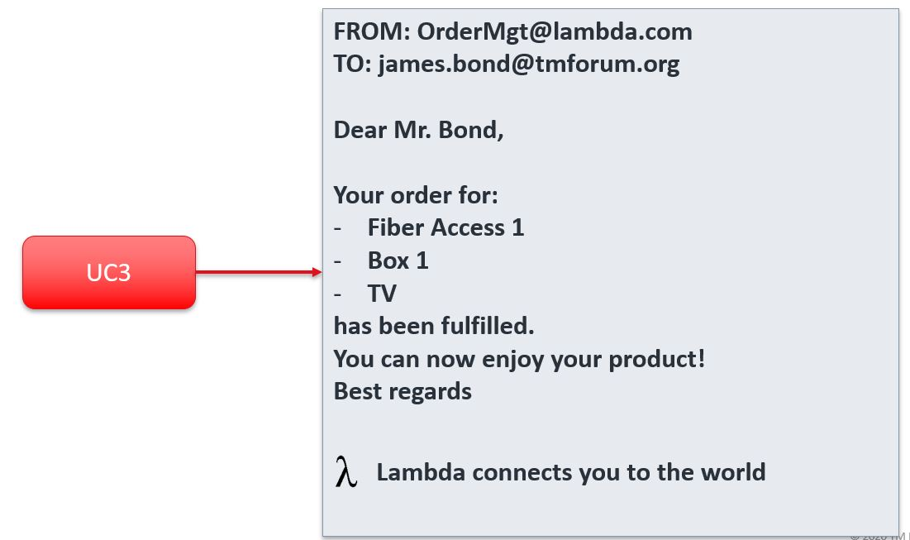

== UC004: Order Delivery – Fiber contract

=== Description

* This use case illustrates the delivery of the customer order previously described and validated in UC3, and its closing
* Several steps are shown
** The global orchestration of the delivery of the products ordered by the customer
** The delegation of the delivery of tangible products to the supply chain
** The delegation of the delivery of products based on CFS to a service order delivery system
** The closure of the customer order
** The interaction triggered to inform the customer that his order is fulfilled

Note: for this UC4 only one approach has been identified

=== Screen flow

Order fulfillment and confirmation to customer:

=== Catalog view

See UC3.

=== API call flow

[plantuml,uc4-orderDelivery-0,png]
----
include::UC4-orderDelivery-0.puml[]
----

[plantuml,uc4-orderDelivery-0,png]
----
include::UC4-orderDelivery-0.puml[]
----

[plantuml,uc4-orderDelivery-0,png]
----
include::UC4-orderDelivery-0.puml[]
----

[plantuml,uc4-orderDelivery-0,png]
----
include::UC4-orderDelivery-0.puml[]
----

