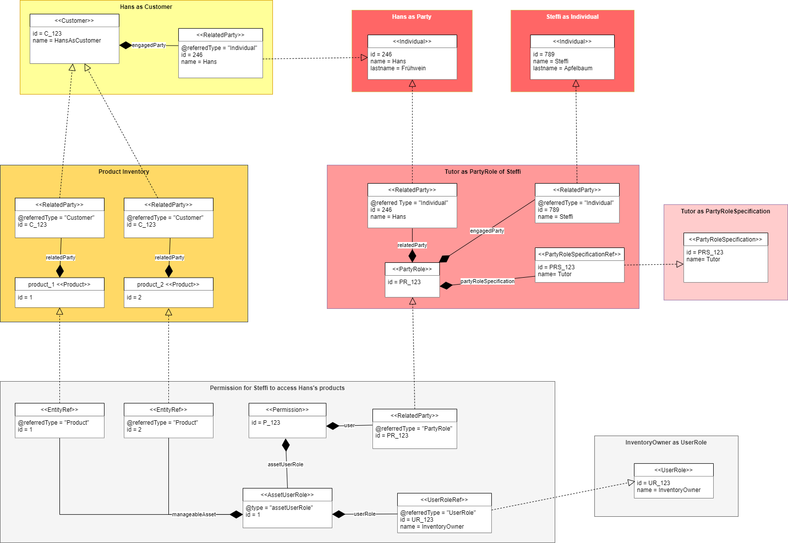
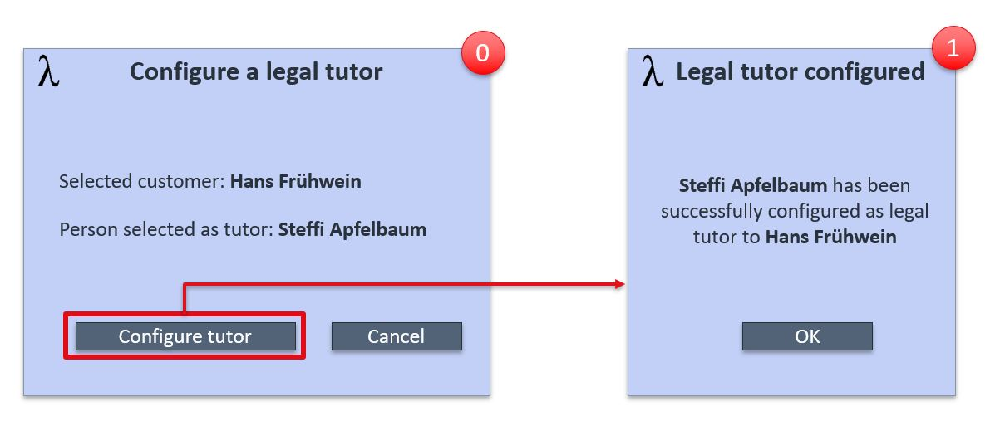
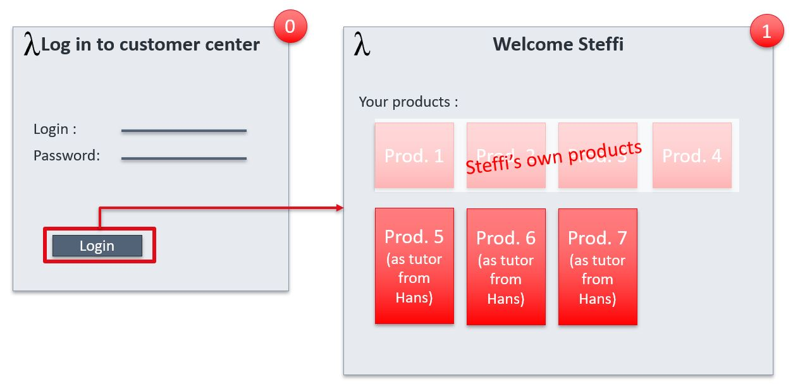

== UC006: Legal tutor sees products of protected adults

Hans, a Lambda customer, has a mild intellectual handicap which affects its ability to make decisions. 
Therefore Steffi has been mandated by the court to represent Hans in contractual matters. 

=== Model

=== Configuration of the tutor

==== Screen flow

Steffi goes to Lambda street shop and presents to the Lambda sales employee, Robert, the mandate she has received from the court.

*Assumption* is that Steffi is already known to Lambda, and registered as Party-Individual.

_Not shown in the screen flow_: Robert opens the customer 360 view of Hans and chooses to configure a legal tutor, then he selects Steffi out of the Party Management.

* Screen 0: Robert's customer application asks for confirmation of Steffi as tutor for Hans

* Screen 1: the system confirms that Steffi has been configured as tutor to Hans

==== API call flow

===== Approach A (SoE steer the process)

=== Tutor sees products of protected adult

==== Screen flow

* Screen 0 : Steffi goes to the customer center and is asked to login

* Screen 1 : Steffi sees her own products (not described in the sequence diagram) and Hans' products, with the mention that she sees those products because she acts as tutor for Hans

==== API call flow

===== Approach A (SoE steer the process)

[plantuml]
----
include::uc6-customer-center.puml[]
----

